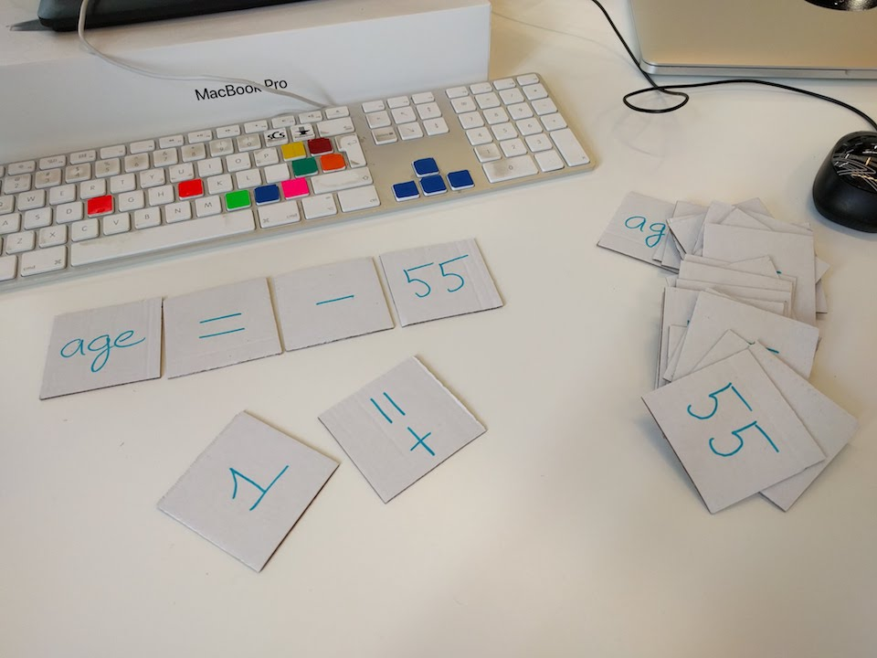

# Operátor-póker

Rakjunk ki minél több értelmes kombinációt ezekből a kártyákból:  
`1`, `55`, `age`, `=`, `-`, `+=`  
(Technikalag: kifejezéseket és értékadásokat.)  

Akárhány kártyát felhasználhatunk, de mindet csak egyszer.  
Vegyük úgy, hogy a kártyák között szóköz van. (Tehát a `-` és az `=` nem egyesíthető `-=`-be, és `age1` vagy hasonló nevű változót sem csinálhatunk.)  

A lányok pár fős csoportokban dolgoznak. Minden csoportnak kiosztjuk a hat kártyát és egy-egy papírlapot, pár perc gondolkodási idő alatt kell minél több helyes változatot felírni.  

A végén körben haladunk, minden csapat bemond egy megoldást. Ha helyes, kihúzzuk a listáról. Ha nem helyes, megbeszéljük, hogy miért.  
Ne számoljuk össze a végén a megoldásokat, a játék és a gyakorlás a lényeg.  

Megoldások:  
```
1  
-1  
1 - 55  
1 - age  

55  
-55  
55 - 1  
55 - age  

age  
-age  
age = 1  
age = -1  
age = 1 - 55  
age = 55  
age = -55  
age = 55 - 1  

age - 1  
age - 55  

age += 1  
age += -1  
age += 1 - 55  
age += 55  
age += -55  
age += 55 - 1  
```

  