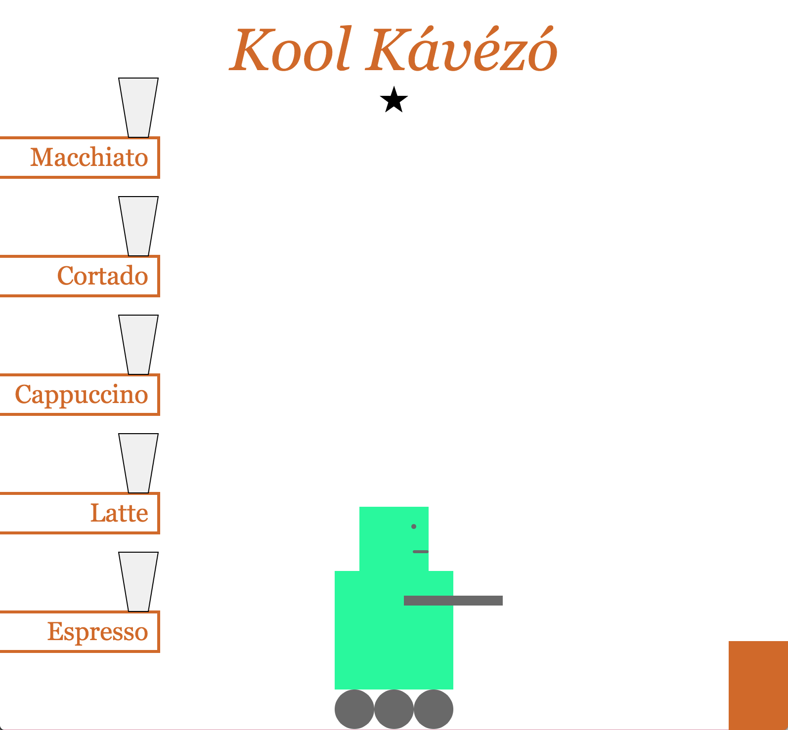

# A programozás alapfogalmai

/// Ehhez az órához előkészítek egy játszóteret, amin meg lehet ismerkedni az alapfogalmakkal. Egy robotot kell irányítani egy kávézóban. Ld. kool-kavezo.html  
///   

## Program vagy parancssor

JavaScriptben nem muszáj rögtön teljes programot írni, lehet egyenként kiadott utasításokkal dolgozni a parancssorban. Az első pár órán még ezt tesszük, utána kezdünk el kódszerkesztőben dolgozni.  

A parancssor legegyszerűbb felhasználási módja: számológép. Összeadás, kivonás, szorzás, osztás, zárójelezés.  

* Vondd ki a születési évszámodból a születési hónapod és napod szorzatát! Mennyit kaptál? Ez lesz a mai órán a szerencseszámod, jegyezd meg.  
/// Ez egy átverés, nem is használjuk később. De megtehetnénk.  

## Alapfogalmak

Itt tudod kipróbálni a lent leírtakat: http://jsbin.com/beqiriq/edit?console,output  
/// Illetve: [kool-kavezo.html](.kool-kavezo/kool-kavezo.html)  
_Ha van egy nagy világoskék sáv az oldal tetején, azt zárd be a bal felső sarkában lévő x-szel._  
_Ha nem indul el a program, vagy ha valamikor később elromlik és újra szeretnéd indítani, nyomd meg a jobb felső sarokban lévő "Run with JS" gombot!_  

### ÁLTALÁBAN

#### Parancsok

Parancs kiadása: begépeled a parancs nevét, közvetlenül mögé nyitó és csukó zárójelet írsz, és entert nyomsz. Próbáld ki: `help()`  

Gondolj úgy a zárójelekre, mintha az lenne a felkiáltójel a parancs végén.

* Mit csinálnak a következő parancsok?
  * `cursor()` és `noCursor()`
  * `showData()` és `hideData()`

Van olyan parancs, amihez információkat is kell megadnunk, például: `alert("Szia!")`  — Csinál egy felugró ablakot, és meg kell neki mondani, milyen szöveget írjon bele. Programozásban a szöveget mindig idézőjelek közé kell tenni.

* Miért, mit csinál az, hogy `alert(Szia!)`?

Mivel ez egy macskabarát kávézó, lehet macskákat hívni, de meg kell mondani, mennyit: `cat(5)`  — Ha a megadott információ szám, akkor nem kell köré időzőjel.  

> Ezeket a parancsokat programozásban _függvényeknek_ nevezzük.  
> Mikor kiadunk egy parancsot, azt mi úgy mondjuk, hogy _meghívjuk_ a függvényt.  

#### Adatok

A program tud adatokat tárolni, amiknek ilyenkor nevet kell adni. A mi programunkban eleve van pár adat, például `company` és `stars`. Az adatokat úgy tudod megnézni, hogy beírod a nevüket és Entert nyomsz.  

Módosítani pedig úgy tudod őket, hogy egyenlőségjelet írsz mögéjük, és az új értéket: `stars = 4` vagy `company = "Starbucks"`  

Figyelem, ez nem a matekból ismert egyenlőségjel. Nem azt jelenti, hogy "egyenlő", hanem azt, hogy "mostantól legyen ez".  

* Működik a `company = Starbucks` is? És ha igen, miért nem?  

További adatok: `nameSize`, `nameColor`, `wallColor`, `zoom`.

A szám típusú adatokat nem muszáj kész számként megadni, ki is lehet számolni: `stars = 2 + 3`  

A szöveg típusúakat szintén össze lehet fűzni más szövegekből: `company = "Star" + "bucks"`  

Az adatok kaphatnak értéket másik adatból is: `stars = nameSize` vagy `company = wallColor`  

* Most akkor`company = wallColor` vagy `company = "wallColor"`?  

A szám típusú adatokat lehet növelni vagy csökkenteni is: `stars += 1` vagy `nameSize -= 10`  

Új adatokat is tudunk csinálni, ugyanúgy, mintha egy meglévő módosítanánk: `myName = "Marca"` vagy `myAge = 26`. Sőt: `myLuckyNumber = 1991 - 7 * 22`  

> Az adatok neve programozásban: _változó_.  
>
> A szöveg típust hivatalosan _"string"-nek_ nevezzük.  

/// Változók és operátorok gyakorlására: [opetáror-póker](.operator-poker/operatorpoker.md)  

#### És a kettő együtt

Azoknál a parancsoknál, amiknek információra van szüksége a futáshoz, ez az információ jöhet változóból is. Például: `alert(company)` és `cat(stars)`.  

* Mi a különbség az `alert(company)` és az `alert("company")` között?

Ilyenkor is lehet még az értékekkel műveleteket végezni, pl `cat(stars * 2)` vagy `alert("The color of the wall is " + wallColor)`.  

> Ha egy parancs bemenő információkat vár, azt _argumentumnak_ vagy _paraméternek_ nevezzük.

### SZEREPLŐKNÉL

#### Saját parancsok

A programunkban van egy szereplő: Bob, a barista robot. Bobnak vannak saját parancsai, amiket úgy érhetünk el, hogy `bob.` után gépeljük be őket, pl. `bob.jump()`  

Bob további néhány parancsa: `bob.left()`, `bob.right()`,`bob.say()` (szöveget vár).  

#### Saját adatok

Bobnak vannak saját adatai is: `lift`, `color` és `mood`. Ezeket ugyanúgy tudjuk állítani, mint más adatokat.  

> Azokat a parancsokat és adatokat, amik nem bobhoz tartoznak, _globális_ függvényeknek és változóknak nevezzük.

#### És a fentiek bárhogy kombinálva

A fentieket bárhogy kombinálhatjuk.  

* Emeltesd bobot olyan magasra, ahány csillagos a kávézó!
* Mondasd ki bobbal a kávézó nevét!
* Hívj be annyi macskát, amilyen jó bob kedve!
* Állítsd be a kávézó nevét bob színére!

> Ezeket a szereplőket vagy tárgyakat — egyszóval önálló csomagokat, amiknek saját függvényeik és változóik vannak, _objektumnak_ nevezzük.  

### KÉRDÉSEK

#### Általában

A parancs mellett van egy másik fajta függvény is: a kérdés. Ránézésre nincs semmi különbség, ugyanúgy kell őket leírni, de ezekkel nem valamilyen hatást akarunk kiváltani, hanem valamilyen választ szeretnénk kapni.  

Például: `dayName()` — megadja a mai nap nevét. A `day()` azt, hogy hányadika van.  

A kérdések is várhatnak információt: például az `uppercase()` egy szöveget vár, és visszaadja csupa nagybetűvel. A `random()` pedig két számot vár, és visszaad egy véletlenszámot a két megadott határ között.  

A `round()` egy tört számot vár, és visszaadja kerekítve. A `min()` és a `max()` több, vesszővel elválasztott számot vár, és visszaadja közülük a legkisebbet, illetve legnagyobbat, pl.: `min(10, 30, 45, 2, 26)`  

> Ezeknek a függvényeknek úgynevezett _visszatérési értéke_ van.  

#### Elmentés adatként

Kérdésre érkező választ el tudunk menteni adatként: pl. `company = dayName()` vagy `bob.mood = random(-5, 5)`  

/// Rávezető kérdéssel: hogyan érjük el, hogy bob kedve véletlenszerű legyen -5 és 5 között?  

#### Felhasználás parancsban

A kérdésekre érkező választ át tudjuk adni egy parancsnak: pl. `bob.say(dayName())` vagy `cat(day())`.  

/// Rávezető kérdéssel: hogyan érjük el, hogy bob kimondja a mai nap nevét?  

#### Felhasználás kérdésben

Sőt, a kérdésekre érkező választ továbbadhatjuk egy következő kérdésbe is: `round(random(1, 5))` vagy `alert(uppercase("coffee"))`.  

#### Bármilyen kombináció

Bárhogy kombinálhatod:

* bob kimondja a saját színének a nagybetűsített változatát: `bob.say(uppercase(bob.color))`
* véletlenszám 0 és a kávézó csillagainak száma között: `random(0, stars)`

Stb.  

/// Kivetítendő kérdések:  

/// Véletlen számú macska 10 és 20 között  
/// bob kedve legyen a kisebbik bob magassága és a csillagok száma közül  
/// A kávézó neve legyen a mai nap neve csupa nagybetűvel  
/// Milyen kombókat tudsz még összerakni?  

