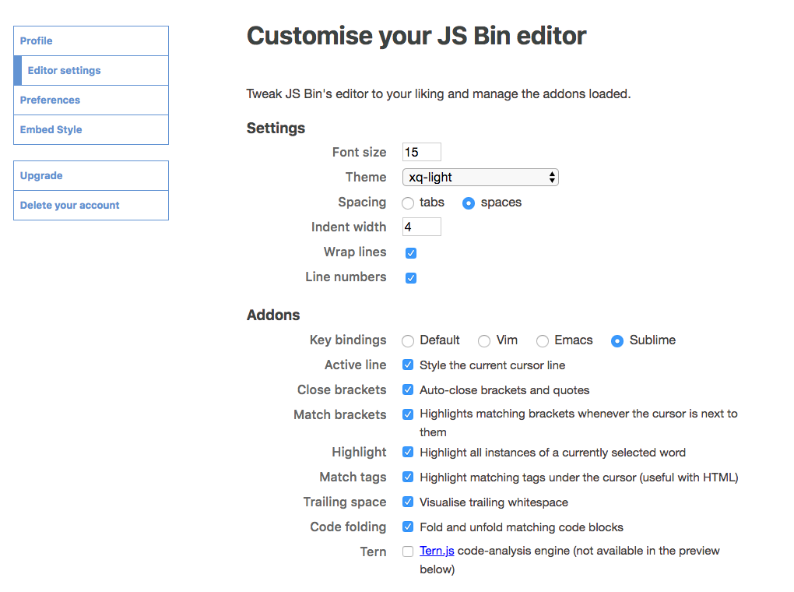
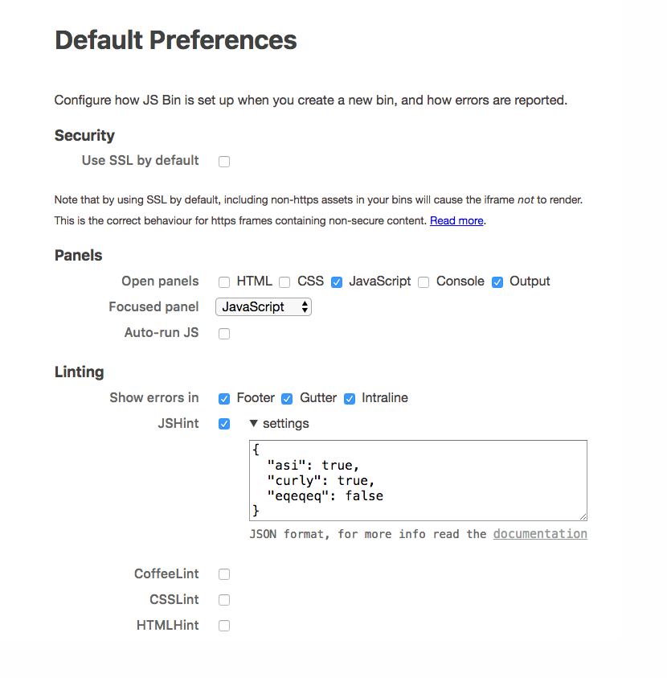

# JSBin regisztráció és beállítás

1. Regisztrálj a [github.com](https://github.com) weboldalon: menj az oldalra, töltsd ki a felhasználónevet, emailt, jelszót, és kattints a nagy zöld "Sign up for GitHub" gombra.  
2. A [jsbin.com](http://jsbin.com) oldalon kattints jobb felül a sárga "Login or register" feliratra, és a nagy "Login or Register via GitHub" gombra.  
3. Ha sikerült bejelentkezni, kattints jobb felül az "Account" menüpontra, ott pedig az "Editor settings"-re. Itt állíts be mindent úgy, ahogy a képen látod:  
  
4. Utána kattints bal oldalt a "Preferences" menüpontra, és állíts mindent úgy be, ahogy itt látod:  
  
A "JSHint" résznél rá kell kattintani a "Settings" feliratra, és ezt bemásolni a szövegmezőbe:  
```
{
  "asi": true,
  "curly": true,
  "eqeqeq": false
}
```

Kész! Mostantól el tudod menteni az órán írt programjaidat JSBinre. Kérlek, minden óra elején jelentkezz be a neked jutó laptopon githubra, onnan jelentkezz be jsbin-re, és akkor megtalálod a korábban írt dolgaidat. Óra végén pedig légyszíves jelentkezz ki mindekettőből.  
