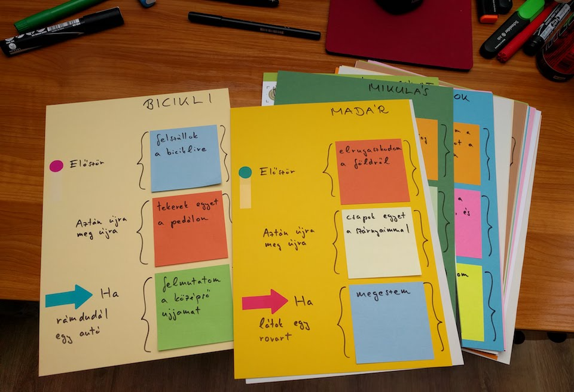

# Mátrix-építés

Ebben a játékban a Mátrix programozói vagyunk, és a valós élet élethű mását kell létrehoznunk. Sok kicsi programot írunk az élet különböző szereplőire. Minden programot egy három elemű sablonba írunk bele: először; újra meg újra; reakció.
(Update: a lányok nem különösebben vágták a Mátrixot. Lehet, hogy manapság már Westworldöt kell mondani, ha programozott világra akar utalni az ember.)    

Sablon:  
* Először:  
* Aztán újra meg újra:  
* Ha <esemény>:  

A lányok kis csoportokba rendeződnek, és csoportonként három programot kapnak. Minden programohoz tartozik egy sablon (egy papírlap, amin fel van tüntetve a három blokk, és ki van rajta töltve az "esemény" rész) és három post-it rajta a három cselekvéssel. A lányoknak össze kell raknia a programokat, és a végén minden csapat felolvassa a három közül a kedvencét.  

Esetleg kitalálhatnak saját programot is.  

A munka ideje alatt mehet a háttérben a Matrix rain: http://output.jsbin.com/vayefon/quiet/  
Illetve zenének a filmzene: https://www.youtube.com/watch?v=XbxZargtXug  

Ötlet: a papírokon kapcsos zárójelek jelezzék a blokkok helyét, ezzel már előre sejtetjük a szintaxist.  

* Bicikli
    - Felszállok a biciklire
    - Tekerek egyet a pedálon
    - Ha rámdudál egy autó, felmutatom a középső ujjamat
* Madár
    - Elrugaszkodom a földről
    - Csapok egyet a szárnyaimmal
    - Ha látok egy rovart, megeszem
* Modern festmény
    - Felállítom a vásznamat az utcán és előveszem a festéket
    - Rádobok egy pötty festéket a vászonra
    - Ha egy járókelő megnézi a festményt, megpróbálom eladni neki
* Vízilufi-poén
    - Megtöltök egy lufit vízzel és elbújok az ajtó mögött
    - semmi, csak várok
    - Ha valaki belép az ajtón, megdobom a lufival
* Házőrző-program
    - Kimegyek a házból az udvarra
    - Csóválok egyet a farkamon
    - Ha látok valakit, ugatok rá
* Flappy bird
    - Rajzolok a kijelzőre egy madarat
    - A madarat lefelé mozdítom, a tájat a háta mögött balra (mintha jobbra repülne)
    - Ha a játékos kattint, a madarat felfelé mozdítom
* Riasztó  
    - Csipog, és azt mondja: "a riasztó mostantól aktív"
    - Villan egyet, hogy jelezze: be van kapcsolva
    - Ha zajt észlel: vijjog
* Focista
    - Felveszem a mezt, a sípcsontvédőt, a cipőt
    - Megnézem, merre van a labda, és lépek egyet az irányába
    - Ha a közelembe jön valaki: feldobom magam és reklamálok
* Diák
    - Beülök a padba és kinyitom a füzetemet
    - Ásítok
    - Ha a tanár megkérdezi, figyelek-e, igennel felelek
* Cookie monster
    - Leülök az asztalhoz, ami tele van sütikkel  
    - Megeszem egy darab sütit az asztalról  
    - Ha meglátom egy barátomat, integetek neki  
* Sziszifusz
    - Beleköpök a tenyerembe, és nekitámaszkodom a sziklának
    - Tolok egy kicsit felfelé a sziklán és lépek egyet
    - Ha a szikla legurul, utánamegyek
* Kis hal
    - Előbújok az ikrából
    - Úszom egy kicsit előrefelé és bután nézek
    - Ha megesz egy nálam nagyobb hal, megevődöm
* Csapnivaló programozó
    - Felnyitom a laptopot és bejelentkezem
    - Megnyomok egy véletlenszerű billentyűt a billentyűzeten
    - Ha arra jár a főnököm, hangosan köhögök, hátra betegszabadságra küld
* A Mikulás álmatlan felesége
    - Megígéri, hogy nem fog horkolni, és elalszik
    - Horkant egy nagyot
    - Ha oldalba bököm, felébred, és megígéri, hogy abbahagyja a horkolást, aztán visszaalszik
* Facebook mobilon
    - Megnyitom a Facebookot
    - Görgetek egyet lefelé, és átfutom a posztokat, amiket épp látok
    - Ha jön egy értesítés a Snapchatről, félretolom
* Ügyfélszolgálat
    - Kicsöng a telefon  
    - Bemondja, egy robothang, hogy "jelenleg minden ügyintéző foglalt", és jön fél perc zene
    - Ha felszabadul egy ügyintéző, megszakad a zene és a rendszer kapcsolja az embert  
* Műhold
    - Kinyitom a napelemeimet és az antennámat
    - Küldök egy jelet a Föld felé, hogy még életben vagyok, aztán várok egy percet
    - Ha észlelek valamit, felveszem az összes szenzorommal

  
