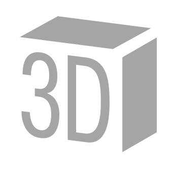
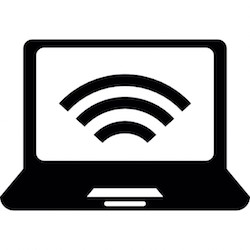

# Programozás határok nélkül

Az utolsó előtti foglalkozásra speciális témakörökkel készültünk. Egyiket sem fogjuk mindenkinek elmondani, hanem mindenki választhat magának kettő témakört, amivel az első, illetve a második 60 percben szeretne foglalkozni. Minden téma mellett szerepelni fog a használati utasítás, és minden témának lesz egy szakértő mentora, aki segít a programozásban.  
A témák leírásában többi-kevésbé konkrét programok vannak leírva, de nem kell feltétlenül ezeket megvalósítani. Nyugodtan alakítsd át a programokat a saját ízlésed szerint.  

Ha a program a `map()` függvény használatát ajánlja, olvasd el itt, hogyan működik: [a map() függvény](map.md).  

Választható témakörök:  

## Grafika
[specialis/grafika.md](specialis/grafika/grafika.md)  
  
Túl a vonalakon és a körökön - fedezd fel a p5.js valódi képességeit! Ha nem ijedsz meg néhány koordinátától és for-ciklustól, vár rád a rekurció, a Perlin-zaj, a még menőbb és még szebb grafika világa.  

---

## 3D
[specialis/3d.md](specialis/3d/3d.md)  
  
Szakadj ki a síkból és nyisd meg a teret! Száguldás az űrben, térben forgó Rubik-kocka és hasonló izgalmas programok kerülhetnek ki a kezed alól. Itt sem árt, ha ha a koordináták a barátaid, hiszen már három van belőlük...  
(Megjegyzés: nem minden gépen és minden böngészőben működik a 3d rajzolás.)  

---

## Hangok
[specialis/hangos.md](specialis/hangos/hangos.md)  
  
Hangszoró is van a gépen, nem csak képernyő - generálj hanghullámokat, beszéltesd a számítógépet, sőt tanítsd meg a számítógépet, hogy megértse a beszédet, és irányítsd beszéddel a programjaidat!  
(Megjegyzés: nem minden gépen és minden böngészőben működik.)  

---

## Zene
[specialis/zene.md](specialis/zene/zene.md)  
  
Minimál techno néhány paranccsal? Sima ügy. Lineáris dobolási mintázatok, szintetizátorok, generált zene, hangeffektek - ha tetszik, amit hallasz, itt a helyed!  

---

## Mobiltelefon
[specialis/mobil.md](specialis/mobil/mobil.md)  
  
Minden programunk fent van az interneten, tehát bármikor megnyithatod őket telefonról is - sőt, kihasználhatod a telód extra képességeit: érintőképernyő, giroszkóp, gyorsulásmérő, és menő programok a tenyeredben!  
(Megjegyzés: nem minden mobilon működik, illetve nem minden mobilon ugyanúgy működik minden program.)  

---

## Távkommunikáció
[specialis/tavkozles.md](specialis/tavkozles/tavkozles.md)  
  
Kiadsz egy parancsot, és lefut a gépeden. Mi lenne, ha kiadnál egy parancsot, és valaki más gépén futna le? Chatelés, távirányítás, multiplayer játékok várnak rád!   
Páros feladat, kettesével gyertek rá.  

---

## Mikrokontroller
[specialis/robot.md](specialis/robot/mikrokontroller.md)  
  
Lépj ki a számítógép virtuális teréből, és vedd kézbe a hardvert! Szereld össze az áramkört a kapcsolási rajz alapján, hogy aztán a gépről irányíthasd, melyik LED világít, vagy éppen az áramkör kapcsolóival irányítsd a programjaidat.  
Páros feladat, kettesével gyertek rá.  
