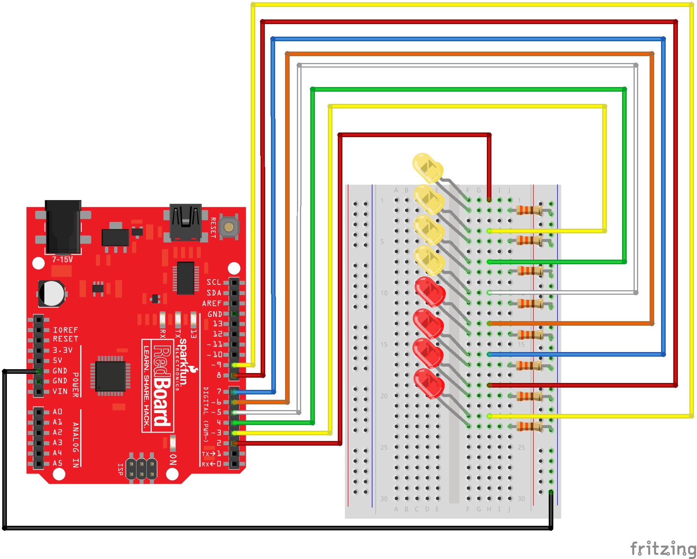

## Mikrokontroller

Programozás Arduino mikrokontrollerekkel  
/// https://github.com/sarahgp/p5bots  
/// TODO upload firmata to the boards!  
/// Továbbá: ezt a Skool windowsos gépein nem tudtam működésre bírni, úgyhogy a lányok kölcsönmacbookokon dolgoztak.  


### Előkészítés

Ezeket a programokat nem tudjuk JSBinbe írni, a gépen lévő Atom kódszerkesztőt fogjuk használni. Ha elindítod az Atomot, bal oldalt láthatod, hogy három üres programot készítettem elő, amibe írhatsz kódot, de ha több kell, a mellettük lévő sablon lemásolásával lehet továbbiakat készíteni.  
A programok `setup` blokkjában csatlakozni kell a kontrollerhez:  
```javascript
board = p5.board("/dev/cu.usbserial-DN02SQ06", "arduino")
```
Az első paraméter mindig az adott számítógéptől függ.  
Ez után a kontrollerre feltett egyes elemeket a `board.pin()` függvénnyel tudjuk létrehozni, aminek mindig az adott alkatrésztől függően kell extra adatokat átadni, és a használata és az adott típustól függ.  

A programok futtatásához parancssorban a fájlokat tartalmazó könyvtárhoz kell navigálni, és kiadni a `bots-go -d .` parancsot. Az eredmény a http://localhost:8000/ címen nyitható meg böngészőben. A mentorod segít ezekben a lépésekben.   

### Programötletek

#### Tekerő

Irányítsunk programot potenciométerrel! A potenciométer (röviden potméter vagy csak poti) egy tekerhető gomb, olyan, mint egy hangerőszabályzó.  
/// https://learn.sparkfun.com/tutorials/sparkfun-inventors-kit-experiment-guide---v40/circuit-1b-potentiometer  
/// https://github.com/sarahgp/p5bots/tree/master/examples#analog-read  

Építsd meg az áramkört a kapcsolási rajznak megfelelően:  
  
(A LED a bal felső részen nem kell rá, sem a hozzá tartozó sárga és fekete vezeték.)  

Aztán jön a programozás. A `setup` blokkban hozzatok létre egy `board` konrollert. A potmétert így tudjátok rajta kiválasztani:  
```javascript
pot = board.pin(0, 'ANALOG', 'INPUT')
pot.read()
```
(A 0 azt jelenti, hogy a potihoz tartozó vezeték az A0-hoz van csatlakoztatva a knotrolleren.)  
Ha ez megvan, a tekerő aktuális értékét a `pot.val` változóval éritek el. A változó értékem 0 és 1023 között mozog.  
Megjegyzés: a program indulásakor pár pillanat még lehet, hogy nincs értéke a `pot.val` változónak. Ha mégis megpróbáljuk kiolvasni az értéket, a programunk hibát jelez még leáll. Ezt úgy tudjuk elkerülni, hogy a `pot.val` helyére ezt írjuk: `(pot.val || 0)` - ez a forma automatikusan 0-val helyettesíti be az értéket, ha a `pot.val` változó maga még definiálatlan.  
Írjatok egy programot, amiben egy sprite van a vászon közepén, és a sprite nagyítása (`scale`) a potméter értékétől függ! (Ne egy az egyben adjátok át a poti értékét, mert nem akarunk egy ezerszeres méretű sprite-ot, inkább osszátok el 200-zal.)  
Megírhatjátok azt is, hogy a sprite forgása (`rotation`) a poti forgását kövesse. Használjátok a `map()` függvényt, hogy a `pot.val` értékét átvigyétek a 0-1023 tartományról a 0-360 tartományra.  
Vagy írhatjátok azt, hogy a sprite forgási sebessége `rotationSpeed` függjön a potitól.  

/// Példamegoldás: [.peldamegoldas/poti.js](.peldamegoldas/poti.js)  

#### Szervómotor

A szervómotor olyan mozgó egység, amit pontos szögekbe lehet beállítani (szemben egy sima forgó motorral, ami csak pörög).  
Így építsétek meg az áramkört:  
  
Az ábra kicsit egyszerűsít, nincs benne jelölve a szervómotorból kilógó kábelek végén lévő, három lyukkal ellátott csatlakoztató. Úgy kell érteni, hogy annak a csatlakoztatójában a fekete kábelhez kell dugni a kapcsolási rajzon is látható fekete kábelt, a piroshoz a pirosat, a fehérhez a sárgát.  

Aztán jöhet a programozás. Hozz létre egy `board` kontrollert, aztán csatlakozz a szeróhoz:  
```javascript
servo = board.pin(9, 'SERVO')
```
Használni pedig úgy tudjátok, hogy a `servo`-n meghívjátok a `write()` függvényt, ami egy számot vár 0 és 180 között, és arra forgatja a szervót.  
Írhattok például egy programot, ami az egér aktuális helye alapján forgatja be a szervót. Használjátok a `map()` függvényt, hogy a `mouseX` értékét ávetítsétek a 0-`width` tartományról a 0-180 tartományra.  
Vagy írhattok olyat, hogy a szervó minden egérkattintásra véletlen irányt vesz 0 és 180 között.  


/// Példamegoldás: [.peldamegoldas/servo.js](.peldamegoldas/servo.js)  

#### Piezo zümmögő
/// https://github.com/sarahgp/p5bots/tree/master/examples#piezo-tone--knock  
/// https://learn.sparkfun.com/tutorials/sparkfun-inventors-kit-experiment-guide---v40/circuit-2a-buzzer

Használjunk piezoelektromos hangszórót hangadásra!  
Kapcsolási rajz:  
  
(A potméterrel a hangerőt lehet szabályozni.)  

Programban: hozzátok létre a `board` kontrollert, aztán a piezo-t így:
```javascript
piezo = board.pin(10, 'PIEZO')
```  
Hangot kiadni úgy lehet a piezoval, hogy meghívjátok a `tone()` függvényét, ami két számot vár: a hangmagasságot (frekvenciában) és azt, hogy milyen sokáig adja ki a hangot (ezredmásodpercben).  
Például egy normál zenei A hang fél másodpercig:  
```javascript
piezo.tone(440, 500)
``` 

Programötlet: írjátok meg, hogy valahányszor kattintotok, a hangszóró kiad egy hangot. A hang magassága az egér függőleges helyzetétől függjön, a hosszúsága a vízszintestől.  
Használjátok a `map()` függvényt, hogy a `mouseY` változót átvetítsétek a `height`-0 tartományról az 1000-20000 tartományra, illetve hogy a `mouseX` változót átvetítsétek a 0-`width` tartományról a 10-1000 tartományra.  

/// Példamegoldás: [.peldamegoldas/piezo.js](.peldamegoldas/piezo.js)  

#### LED-ek

Kapcsolási rajz:  
  
Először csak egy ledet tegyetek be, azt, ami az áramkörök a 2-eshez csatlakozik.  
A `setup` blokkban hozzátok létre a kontrollert. A ledet így éritek el rajta:  
```javascript
led = board.pin(2, 'LED')
```
Utána pedig a `led.on()` és `led.off()` parancsokkal tudjátok irányítani.  
Hozzatok létre például egy sprite-ot a vászon közepén, aminek "igaz" a `mouseActive` változója, aztán a `draw` blokkban mindig vizsgáljátok meg, hogy fölötte van-e éppen az egér (`mouseIsOver`). Ha igen, kapcsoljátok be a ledet, ha nem, kapcsoljátok ki.  
Ha ez működik, betehetitek a többi ledet is, és írhattok egy programot, ami mind a nyolcat vezérli. Például úgy, hogy nyolc nagy sprite tölti ki a vásznat, és amelyik fölé húzod az egeret, annak a ledje kapcsol be. Vagy úgy, hogy billentyűk lenyomásával váltogatod, melyik led égjen (pl. a sorszámukat kell megnyomni a billentyűzetet).  

/// Túlbonyolított példamegoldás: [.leds.js](.peldamegoldas/leds.js)  
